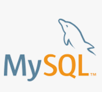
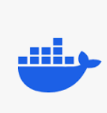
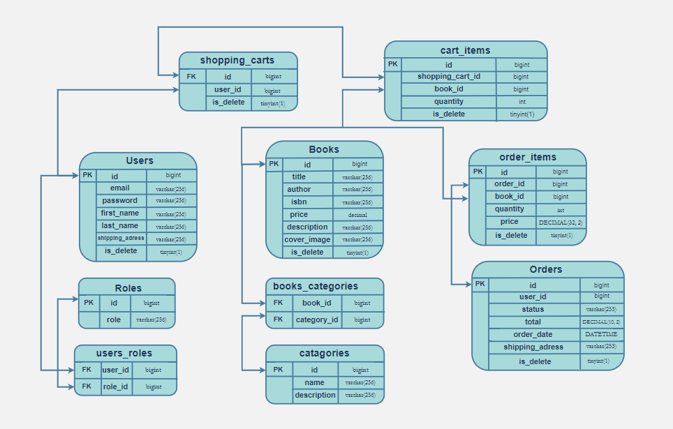

<h1 align="center" style="display: block; font-size: 1em; font-weight: bold; margin-block-start: 0.5em; margin-block-end: 1em;">
<picture>

</picture>
<br /><br /><strong>Online Book Store</strong>
</h1>

<div>

# <picture></picture> Navigation Table

---

- [Introduction](#introduction)
  - [What inspired me to create this project?](#what-inspired_me_to_create_this_project)
  - [What problems does my project resolve?](#what_problems_does_my_project_resolve)
  - [What can do roles USERS and ADMINISTRATORS?](#what_can_do_roles_users_and_administrators)
    - [USERS](#role-user)
    - [ADMINISTRATORS](#role-administrator)
- [Technologies and Tools Used](#technologies-and-tools-used)
   - [Technologies](#technologies)
   - [Tools](#tools)
- [Functionality of controllers](#functionality-of-controllers)
   - [Authentication Management](#authentication-management)
   - [Book Management](#book-management)
   - [Categories Management](#categories-management)
   - [Order Management](#order-management)
   - [ShoppingCart Management](#shoppingcart-management)
- [Getting started project](#getting-started-project)
- [API Documentation](#api-documentation)
- [Testing in Postman](#testing-in-postman)
- [Challenges & Solutions](#challenges-&-solutions)
- [Contacts](#contacts)

</div>

---

<div>

# <picture></picture> Introduction

---

### **What inspired me to create this project?**

The primary inspiration for this project was my desire to build a robust backend system that interacts seamlessly with APIs. I envisioned creating a fully functional online bookstore, a platform that would provide users with an easy-to-navigate interface for browsing, purchasing, and managing books. This project allows me to delve deeper into backend development, honing my skills in API integration, data management, and scalability. By working on this, I aim to create a service that could be expanded upon in the future and potentially serve as a foundation for other API-driven applications.


### **What problems does my project resolve?**

This web application addresses several key issues related to the selection and purchase of books online. It provides a seamless platform where users can easily browse through various book categories, search for specific titles, and make purchases in a user-friendly and efficient manner. The application simplifies the shopping experience by organizing books into relevant categories, allowing users to quickly find what they are looking for.

Moreover, it resolves common challenges such as the difficulty of managing large inventories, offering a well-structured interface that supports both users and administrators in handling data efficiently. The integration of secure payment methods ensures that transactions are safe, further enhancing the overall customer experience. This project also paves the way for scalability, allowing for future expansion to include features such as personalized recommendations, user reviews, and enhanced filtering options.

---

### **What can do roles USERS and ADMINISTRATORS?**

#### *Role: USER*

- Can register an account.
- Can search for books based on various criteria (e.g., title, author, ISBN).
- Can add books to the shopping cart.
- Can edit their shopping cart (e.g., remove books).
- Can update the quantity of books in the shopping cart.


#### *Role: ADMINISTRATOR*
- Has the ability to add, update, and delete books in the system.
- Can manage book categories, including adding, removing, and modifying them.
- Has the authority to set and modify book prices.

</div>

---

<div>

# <picture></picture> Technologies and Tools used

---

## Technologies: 

- ### <a href="https://docs.oracle.com/en/java/javase/17/docs" target="_blank"> <picture></picture> JAVA 17</a>
- ### <a href="https://docs.spring.io/spring-boot/index.html" target="_blank"><picture></picture> Spring Boot</a>
- ### <a href="https://docs.spring.io/spring-security/reference/index.html" target="_blank"><picture></picture> Spring Boot Security </a>
- ### <a href="https://docs.spring.io/spring-data/jpa/reference/index.html" target="_blank"><picture></picture> Spring Data JPA </a>
- ### <a href="https://projectlombok.org/features/" target="_blank"><picture></picture> Lombok </a>
- ### <a href="https://mapstruct.org/" target="_blank"><picture></picture> MapStruck </a>
- ### <a href="https://jwt.io/introduction" target="_blank"><picture></picture> JSON Web Token </a>
- ### <a href="https://tomcat.apache.org/tomcat-8.5-doc/index.html" target="_blank"><picture></picture> Tomcat </a>
- ### <a href="https://dev.mysql.com/doc/" target="_blank"><picture></picture> MySql 8 </a>
- ### <a href="https://hibernate.org/orm/documentation/6.6/" target="_blank"><picture></picture> Hibernate </a>
- ### <a href="https://docs.liquibase.com/home.html" target="_blank"><picture></picture> Liquibase </a>
- ### <a href="https://swagger.io/docs/" target="_blank"><picture></picture> Swagger </a>
- ### <a href="https://docs.spring.io/spring-data/jpa/docs/current/api/org/springframework/data/jpa/repository/JpaRepository.html" target="_blank">JpaRepository </a>
- ### <a href="https://docs.spring.io/spring-boot/reference/io/validation.html" target="_blank">Spring Boot Validation </a>
- ### <a href="https://docs.spring.io/spring-security/site/docs/current/api/org/springframework/security/web/SecurityFilterChain.html" target="_blank">SecurityFilterChain </a>
- ### <a href="https://docs.spring.io/spring-data/rest/reference/paging-and-sorting.html" target="_blank">Paginating & Sorting </a>
- ### <a href="https://www.baeldung.com/spring-jpa-soft-delete" target="_blank">Soft Deleting </a>
- ### <a href="https://www.baeldung.com/role-and-privilege-for-spring-security-registration" target="_blank">Access by roles </a>

## Tools:

- ### <a href="https://maven.apache.org/" target="_blank"><picture></picture> Maven </a>
- ### <a href="https://junit.org/junit5/" target="_blank"><picture></picture> JUnit 5 </a>
- ### <a href="https://www.docker.com/" target="_blank"><picture></picture> Docker </a>
- ### <a href="https://testcontainers.com/" target="_blank"><picture></picture> Testcontainers </a>
- ### <a href="https://swagger.io/tools/swagger-ui/" target="_blank"><picture></picture> Swagger UI </a>
- ### <a href="https://www.postman.com/" target="_blank"><picture></picture> Postman </a>
- ### <a href="https://www.jetbrains.com/ru-ru/idea/" target="_blank"><picture></picture> IntelliJ IDEA </a>
- ### <a href="https://github.com/" target="_blank"><picture></picture> GitHub </a>
- ### <a href="https://aws.amazon.com/ru/free/?gclid=EAIaIQobChMIsYGZ5KHWiAMVJ1JBAh3PaTbzEAAYASAAEgI_uPD_BwE&trk=f17b4b4e-aa1b-4189-b0c4-81a19b53f625&sc_channel=ps&ef_id=EAIaIQobChMIsYGZ5KHWiAMVJ1JBAh3PaTbzEAAYASAAEgI_uPD_BwE:G:s&s_kwcid=AL!4422!3!645186168166!e!!g!!aws!19579892551!148838343321&all-free-tier.sort-by=item.additionalFields.SortRank&all-free-tier.sort-order=asc&awsf.Free%20Tier%20Types=*all&awsf.Free%20Tier%20Categories=*all" target="_blank"><picture></picture> AWS </a>

</div>

---

<div>

# <picture></picture> Functionality of controllers

---

## <picture></picture> Authentication Management

| HTTP Request| Endpoint          | Description            |
|-------------|-------------------|------------------------|
| POST        | `/auth/registr`   | Register a new user    |
| POST        | `/auth/login`     | Login an existing user |


## <picture></picture> Book Management


| HTTP Request | Endpoint        | Description                             |
|--------------|-----------------|-----------------------------------------|
| GET          | `/books`        | Get a list of all available books       |
| GET          | `/books/{id}`   | Get one book by its ID                  |
| POST         | `/books`        | Create book and save to database        |
| PUT          | `/books/{id}`   | Update one book by its ID               |
| DELETE       | `/books/{id}`   | Delete one book from database by its ID |
| GET          | `/books/search` | Search book by specific criteria        |

## <picture></picture> Categories Management


| HTTP Request | Endpoint                 | Description                                  |
|--------------|--------------------------|----------------------------------------------|
| POST         | `/categories`            | Create category and save to database         |
| GET          | `/categories`            | Get all available categories                 |
| GET          | `/categories/{id}`       | Get one category by its ID                   |
| PUT          | `/categories/{id}`       | Update one category by its ID                |
| DELETE       | `/categories/{id}`       | Delete one category from database by its ID  |
| GET          | `/categories/{id}/books` | Get list of book by categories by the its ID |

## <picture></picture> Order Management

| HTTP Request | Endpoint                           | Description                                                  |
|--------------|------------------------------------|--------------------------------------------------------------|
| POST         | `/orders`                          | Create order and save to database                            |
| GET          | `/orders`                          | Get all orders made by the user                              |
| PATCH        | `/orders/{id}`                     | Update order status by its ID                                |
| GET          | `/orders/{orderId}/items`          | Get all order items by order ID                              |
| GET          | `/orders/{orderId}/items/{itemId}` | Get information about the order item by order ID and item ID |

## <picture></picture> ShoppingCart Management

|  HTTP Request | Endpoint                            | Description                                 |
|---------------|-------------------------------------|---------------------------------------------|
| GET           | `/cart`                             | Get users shopping cart                     |
| POST          | `/cart`                             | Create and add items to shopping cart       |
| PUT           | `/cart/items/{cartItemId}`          | Update quantity by items ID                 |
| DELETE        | `/cart/items/{cartItemId}`          | Delete items from shopping cart by items ID |

</div>

---

<div>

# <picture></picture> Database structure

---



</div>

---
<div>

# <picture></picture> Getting started project

---

## Steps
1. **Prerequisites [Docker](https://www.docker.com/get-started) and [Docker Compose](https://docs.docker.com/compose/install/) on your machine.**
2. **Clone the Repository**
   ```sh
    git clone https://github.com/Dima23-ops5/StringBootIntro.git
    ```
3. **Navigate to the project directory**
    ```sh
     cd StringBootIntro
    ```
4. **Configure Environment Variables**:
 
  - ***Create a `.env` file in the project directory to store your database credentials. This file should contain the necessary environment variables, such as `DB_HOST`, `DB_USER`, and `DB_PASSWORD`.***
  - ***Update the `application.properties` file located in the `src/main/resources` directory with your specific database connection details and any other necessary configurations.***

5. **Set Up the Environment**:

   Ensure Docker and Docker Compose are installed on your system. You can configure environment variables directly in the `docker-compose.yml` file.

6. **Build and Run the Application**:

    ```sh
    docker-compose build
    docker-compose up
    ```

7. **Access the Application**:

   The application will be available at `http://localhost:8080/`.

</div>

---

<div>

# API Documentation

---

To explore and test the API endpoints, you can use Swagger. Swagger provides interactive API documentation that allows you to test endpoints directly from the browser.

- **[Swagger Documentation](http://localhost:8080/swagger-ui/index.html#/)**

---

<div>

# Testing in Postman

---

- ### Postman collection
[Book Store.postman_collection.json](Book%20Store.postman_collection.json)

- ### Short instruction how to use postman collection
You can view the instructional video via this link : https://www.loom.com/share/5989d84459324ed7a4badabb21d7babc?sid=e8b4b142-7767-4cf0-88c7-c3e6ee3140bb

</div>

# <picture></picture> *Challenges & Solutions*

---

1. **Controller Testing and User Authentication**

 One of the most difficult tasks was writing unit tests for the controllers, particularly when dealing with user authentication in the Shopping Cart controller tests. The issue was related to properly authenticating users during the tests. The solution involved ensuring that all required entities were correctly added to the test database and applying the `@WithUserDetails` annotation on the test class to simulate a logged-in user.

2. **Creating the `.jar` File and Docker Integration**
   Another significant challenge was correctly generating the `.jar` file for the project. This issue was compounded by problems with Docker integration. The solution was to update the IntelliJ IDEA settings to specify the correct path to the main class, as well as fixing issues in the `pom.xml` file. These adjustments ensured that the `.jar` file was correctly built and integrated with Docker without further issues.

By addressing these challenges with the appropriate solutions, I was able to successfully overcome the obstacles and move forward with the project.
</div>

---

<div>

# Contacts

---

For any questions or suggestions, feel free to reach out:

- GitHub: [Dima23-ops5](https://github.com/Dima23-ops5)
- email: dmmhnk23@gmail.com
 
</div>

